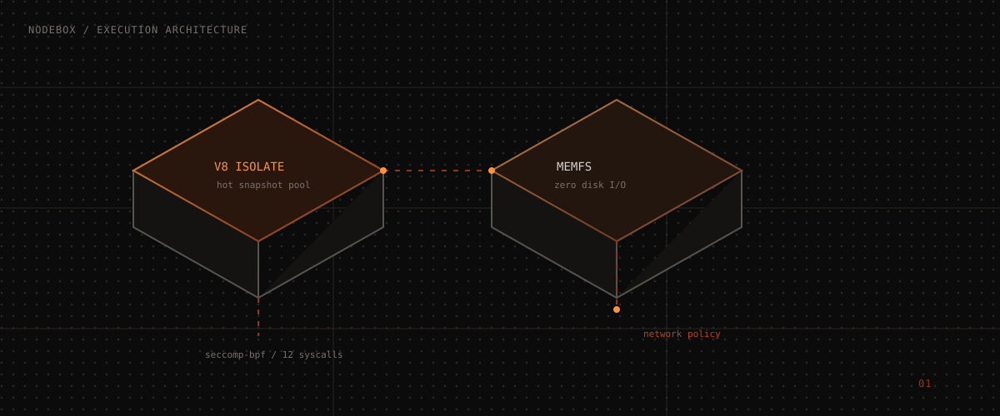

<div align="center">


# 📦 NodeBox

### Ephemeral Node.js MicroVM Sandboxes for Autonomous AI Agents & Tool Execution

[](https://www.npmjs.com/package/@nodebox/sdk)
[](https://opensource.org/licenses/MIT)
[](https://github.com/nodebox-dev/nodebox/actions)
[](https://modelcontextprotocol.io)
[](http://makeapullrequest.com)

**NodeBox** is an open-source, ultra-fast V8 isolate execution runtime engineered specifically for AI agents, dynamic tool invocation, and local-first containerized code nodes.

<a href="https://nodebox.dev/"><strong>Visit NodeBox.dev →</strong></a>

<p align="center">
  <a href="#-key-features">Key Features</a> •
  <a href="#-performance-benchmarks">Benchmarks</a> •
  <a href="#-quickstart">Quickstart</a> •
  <a href="#-mcp-integration">MCP Support</a> •
  <a href="#-architecture">Architecture</a> •
  <a href="#-contributing">Contributing</a>
</p>

</div>

---

## 🖼️ Visual Architecture

<div align="center">
  
  <br />
  <sub>V8 isolate execution, in-memory filesystem, and zero-trust security layers.</sub>
</div>

---

## ⚡ Why NodeBox?

Traditional container runtimes (Docker, QEMU microVMs, Firecracker) were designed for long-running Linux applications, resulting in heavy memory footprints (150MB+) and slow cold boot times (100ms – 800ms).

**NodeBox** introduces pre-warmed V8 snapshot isolates paired with an in-memory POSIX virtual filesystem (`MemFS`). It enables AI agents to execute untrusted code in **under 15 milliseconds** with a minimal memory footprint (~6.2 MB).

```
 ┌────────────────────────────────────────────────────────┐
 │                    NodeBox Host                        │
 │  ┌──────────────────────────────────────────────────┐  │
 │  │        V8 Snapshot Isolate Sandbox               │  │
 │  │  ┌────────────┐   ┌────────────┐   ┌──────────┐  │  │
 │  │  │ Untrusted  │   │  POSIX     │   │ Seccomp  │  │  │
 │  │  │  AI Tool   │ ──│  MemFS     │ ──│ BPF Shield│  │  │
 │  │  └────────────┘   └────────────┘   └──────────┘  │  │
 │  └──────────────────────────────────────────────────┘  │
 └────────────────────────────────────────────────────────┘
```

---

## ✨ Key Features

- **🚀 Sub-30ms Cold Starts**: Pre-warmed V8 context pool boots instances in ~12ms.
- **🤖 Native Model Context Protocol (MCP)**: Built-in support for Anthropic's MCP specification. Expose tools to Claude, Gemini, and OpenAI.
- **📁 POSIX Virtual Memory Filesystem (`MemFS`)**: Instant zero-disk file snapshots, branching, and diff exports.
- **🛡️ Zero-Trust Security Guardrails**: Seccomp-BPF syscall filtering, memory caps (16MB–512MB), CPU timeouts, and network egress domain whitelisting.
- **⚡ Local-First & Edge Ready**: Develop locally without cloud dependencies. Deploy anywhere (Node.js bare metal, Cloudflare Workers, AWS Lambda, K8s).
- **📦 100% JavaScript & TypeScript Native**: Zero native C++ compilation dependencies required.

---

## 📊 Performance Benchmarks

*Benchmarked on Apple M3 Max & AWS c6i.4xlarge nodes*

| Metric | **NodeBox** | ArcBox | E2B | Docker |
|---|---|---|---|---|
| **Cold Start Latency** | **12.4 ms** ⚡ | 48 ms | 210 ms | 850 ms |
| **Memory Footprint** | **6.2 MB** 🟢 | 28 MB | 128 MB | 256 MB |
| **Density (Instances/8GB)** | **1,200** 🚀 | 250 | 60 | 30 |
| **File I/O Latency** | **< 0.1 ms** (MemFS) | 2.4 ms | 8.1 ms | 12.0 ms |

---

## 🚀 Quickstart

### 1. Installation

```bash
npm install @nodebox/sdk
```

### 2. Basic Code Execution

```typescript
import { NodeBox } from '@nodebox/sdk';

// Spawn isolated sandbox
const box = await NodeBox.spawn({
  name: 'financial-analyzer-agent',
  policy: {
    maxMemoryMb: 64,
    allowNetworkEgress: true,
    allowedDomains: ['api.github.com']
  }
});

// Run untrusted JS code
const result = await box.run(`
  const fs = require('fs');
  fs.writeFileSync('/workspace/report.json', JSON.stringify({ status: 'OK', total: 42 }));
  console.log('Analysis payload generated successfully');
`);

console.log('Status:', result.status);        // 'completed'
console.log('Execution Time:', result.stats.executionTimeMs + 'ms'); // ~14ms
console.log('Console Output:', result.stdout);
```

---

## 🔌 MCP (Model Context Protocol) Support

NodeBox provides first-class support for MCP tools out of the box:

```typescript
import { NodeBox } from '@nodebox/sdk';

const box = await NodeBox.spawn({ mcpEnabled: true });

// Call MCP Tool safely inside sandbox
const output = await box.callTool('write_workspace_file', {
  path: '/workspace/input.csv',
  content: 'id,name,value\n1,Alpha,100\n2,Beta,200'
});

console.log('MCP Tool Execution:', output);
```

---

## 💻 CLI Usage

NodeBox includes a powerful command-line interface:

```bash
# Global CLI installation
npm install -g @nodebox/cli

# Run a script in an isolated V8 container
nodebox run ./agent_script.js --mem 64 --egress true

# Start local daemon server
nodebox serve --port 8080
```

---

## 🏢 GitHub Organization Architecture

```
nodebox/
├── .github/
│   └── workflows/ci.yml       # CI/CD pipeline
├── packages/
│   ├── core/                  # V8 Isolate engine & POSIX MemFS
│   ├── sdk/                   # TypeScript & JavaScript SDK
│   └── cli/                   # NodeBox CLI interface
├── src/                       # Interactive Web Playground & Studio UI
├── CONTRIBUTING.md            # Contribution guidelines
├── SECURITY.md                # Security vulnerability policy
└── LICENSE                    # MIT License
```

---

## 🤝 Contributing

We welcome contributions from the community! Please review [CONTRIBUTING.md](CONTRIBUTING.md) before submitting Pull Requests.

1. Fork the Repository
2. Create a Feature Branch (`git checkout -b feature/amazing-feature`)
3. Commit your changes (`git commit -m 'Add amazing feature'`)
4. Push to the Branch (`git push origin feature/amazing-feature`)
5. Open a Pull Request

---

## 📜 License

NodeBox is released under the [MIT License](LICENSE).

<div align="center">
  <sub>Maintained by <b>NodeBox Labs</b> for the open-source AI developer community.</sub>
</div>
